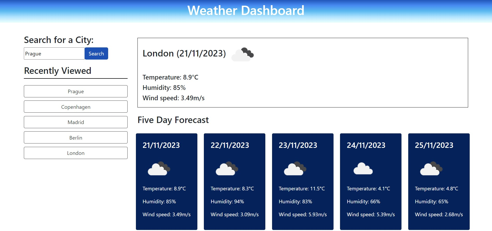

# Weather Dashboard

## Description

Web application allowing the user to view a five-day weather forecast for one location at a time.

The page displays current and future information for the city being looked up, and can store up to five recent searches for later viewing. 

### Visual 

## Installation
No installation needed. 

## Usage
The page can be accessed through the [following link](https://dsciocan.github.io/weather-dashboard).

## Credits
Starter code from [Boot Camp Gitlab](https://git.bootcampcontent.com/uk-edx-16-week/UK-VIRT-FE-PT-09-2023-U-LOLC).

[OpenWeather API](https://openweathermap.org/api) is being used to obtain weather data.

## License
License information is available in the [License](LICENSE) file.
